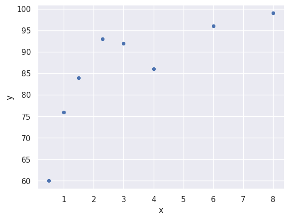
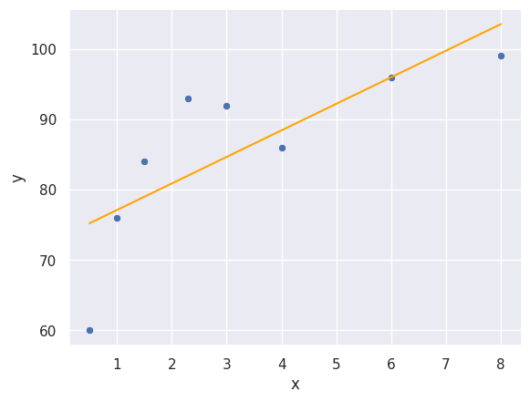

# Toy Dataset


```python
data = ([[1.0], [1.5], [0.5], [2.3], [6], [8], [4], [3]], [76, 84, 60, 93, 96, 99, 86, 92])
```

# Visualization


```python
import seaborn as sns
import pandas as pd
import numpy as np
```


```python
x = np.array(data[0]).flatten()
y = np.array(data[1])

vis_data = pd.DataFrame({'x': x, 'y': y})
```


```python
sns.set_theme()
sns.scatterplot(data=vis_data, x='x', y='y')
```


    <Axes: xlabel='x', ylabel='y'>


    

    


# Linear Regression


```python
from sklearn import linear_model
```


```python
model = linear_model.LinearRegression()
model.fit(data[0], data[1]);
```

# Scores Prediction and Visualization


```python
import matplotlib.pyplot as plt
```


```python
to_be_predicted = np.arange(x.min(), x.max() + 0.1, 0.1).reshape(-1, 1)
prediction_result = model.predict(to_be_predicted)

prediction_data = pd.DataFrame({'x_pred': to_be_predicted.flatten(), 'y_pred': prediction_result})
```


```python
fig, axes = plt.subplots()
sns.scatterplot(data=vis_data, x='x', y='y', ax=axes)
sns.lineplot(data=prediction_data, x='x_pred', y='y_pred', color='orange', ax=axes)
```


    <Axes: xlabel='x', ylabel='y'>


    

    


# Some Singular Prediction


```python
scores_list = [[1.2], [4.5], [0.8], [0.0]]
for score in scores_list:
    print(f"Predicted score after studying for {score[0]} hours is: {model.predict([score])[0]:.1f}")
```

    Predicted score after studying for 1.2 hours is: 77.9
    Predicted score after studying for 4.5 hours is: 90.3
    Predicted score after studying for 0.8 hours is: 76.4
    Predicted score after studying for 0.0 hours is: 73.3

